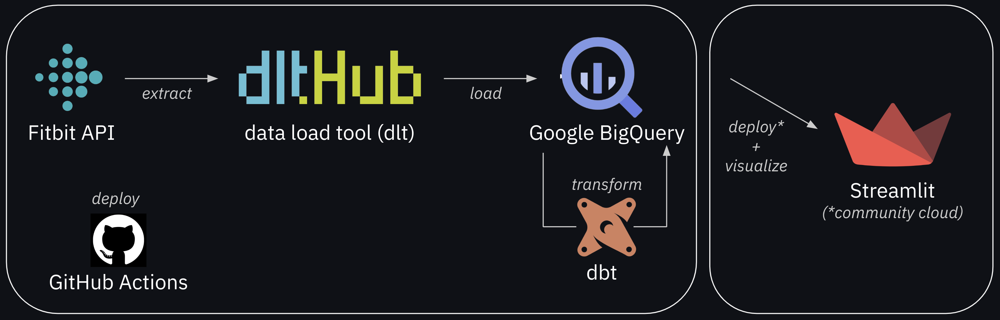

# Fitbit steps: an end-to-end data engineering project

> [!TIP]
> I wrote a blog post describing this project in detail. Check it out [here](https://fnery.io/posts/end-to-end-de-fitbit-data/)!

## Introduction

This repository contains a simple end-to-end data engineering pipeline designed to retrieve, transform, and visualize my Fitbit step data. 

📊 **Check the live dashboard: https://fitbit-steps.streamlit.app/** 📊

## Features

- Data retrieval from the [Fitbit Web API](https://dev.fitbit.com/build/reference/web-api/)
- Data loading using [dlt](https://dlthub.com/)
- Data storage and management in [BigQuery](https://cloud.google.com/bigquery)
- Data transformation using [dbt](https://www.getdbt.com/)
- Interactive visualization through [Streamlit](https://streamlit.io/)
- Automated deployment with [GitHub Actions](https://github.com/features/actions) and hosting on [Streamlit Community Cloud](https://streamlit.io/cloud)
